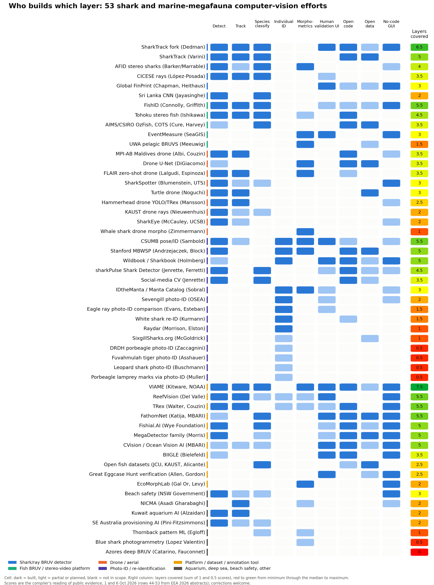
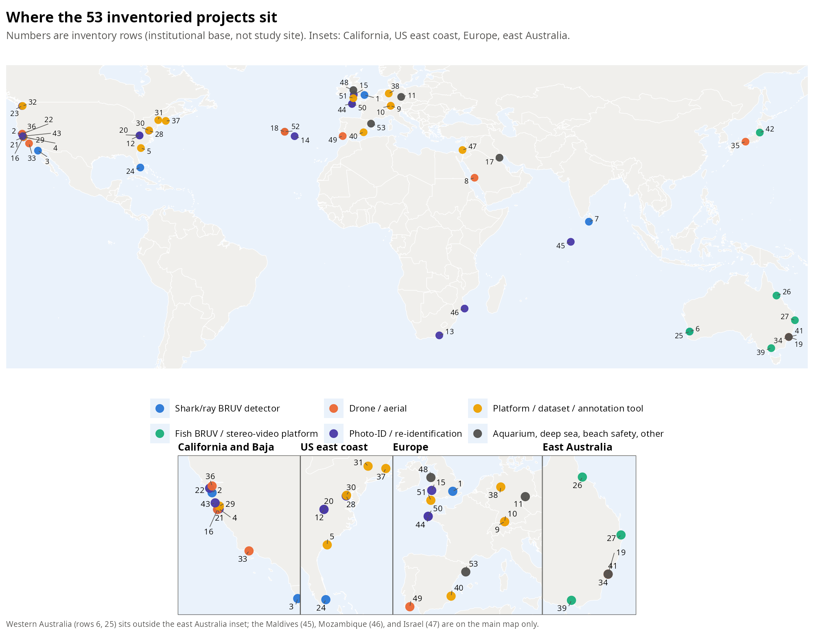
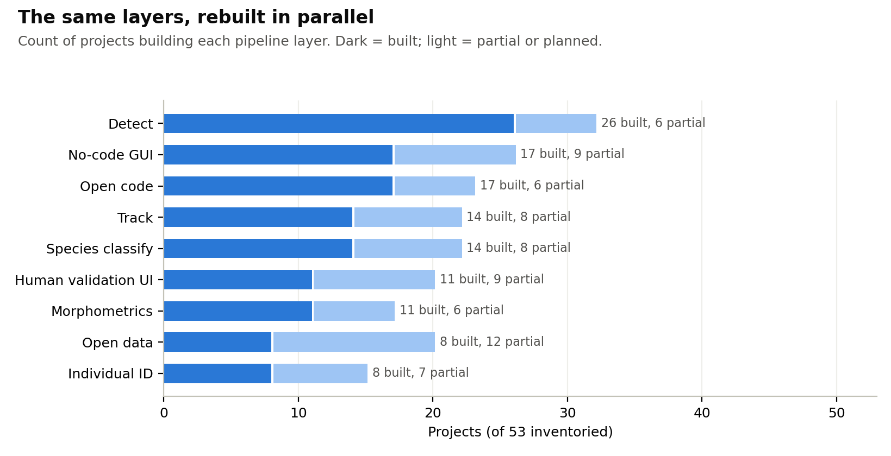
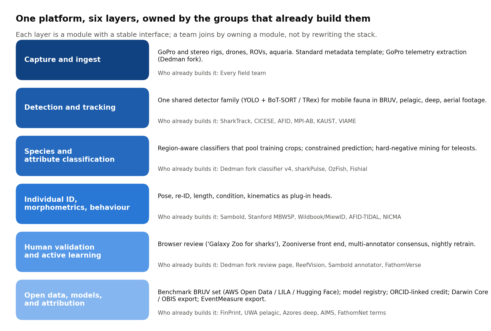

# ocean-ID

**One open platform for shark, ray, and marine-megafauna video analysis.** A consortium, a benchmark dataset, and a build sprint, so that the detection, tracking, classification, individual-ID, and validation layers get built once, together, instead of once per lab.

*Working name; the consortium concept note calls it the Open Marine Vision Network. Presented at the European Elasmobranch Association meeting (EEA 2026, 6 to 8 October 2026, online). Programme lead: Simon Dedman, Florida International University and Saving the Blue.*

## The problem

AI-assisted coding has removed the barrier that used to stop a field biologist from building a detector. The result: 53 shark and marine-megafauna computer-vision projects inventoried in October 2026, of which 26 have built their own detector and 14 their own tracker, almost all on the same Ultralytics YOLO stack, each trained on one region and failing in the next. Only 8 publish data. 8 have automated individual identification; the long-running photo-ID catalogues presented at EEA 2026 are matched by hand. The largest video archives hold no models at all. Nobody connects the layers.

## What we propose

One open platform built as six modules with stable interfaces, each owned by a group that already builds it:

1. Capture and ingest (metadata template, GoPro telemetry, stereo, drone, ROV and aquarium adapters).
2. Detection and tracking (one detector family across BRUV, pelagic, deep, and aerial footage).
3. Species and attribute classification (region-aware classifiers pooling crops from every member; locally plausible species constrained by location).
4. Individual ID, morphometrics, and behaviour (pose, re-identification, length and condition, kinematics as plug-in heads).
5. Human validation and active learning (an expert review tool, a public Zooniverse front end, multi-annotator consensus, nightly retraining).
6. Open data, models, and attribution (a benchmark dataset with contributor-chosen licences, a model registry with provenance, ORCID-linked credit, Darwin Core, OBIS, and EventMeasure export).

**Principles.** Data stay with their owners, under licences the owners choose. Code is MIT or Apache. Any member may fork; the shared repository is where improvements land. Attribution is automatic and public. No member is asked for raw video to join.

## Next steps

- **Gather the team.** A standing consortium of module owners and data holders: a monthly call and a shared GitHub organisation.
- **Release the benchmark.** A licensed shark and ray BRUV dataset with held-out test regions, hosted free on AWS Open Data. Everything else depends on it.
- **Write the grant.** NSF 26-512 AI Datasets (software line), due 4 November 2026; then one joint application per quarter.
- **Propose the hackathons.** A three-day build sprint with a corporate host in February or March 2027, ahead of NVIDIA GTC: parallel modules, an integration contract, one merge on day three, no prize. Then repeat with a second host.
- **Open the validation layer.** The sprint's review-and-active-learning tooling behind a public Zooniverse front end.

## The inventory

53 projects, compiled 1 October 2026 from public sources (GitHub and Zenodo APIs, project pages, conference abstracts) and extended on 6 October 2026 from the EEA 2026 abstract booklet. By category:

- Photo-ID / re-identification: 15
- Platform / dataset / annotation tool: 11
- Drone / aerial: 9
- Aquarium, deep sea, beach safety, other: 7
- Shark/ray BRUV detector: 6
- Fish BRUV / stereo-video platform: 5

The full table is in [inventory.md](inventory.md) (also [inventory.csv](inventory.csv)). Rows 44 to 53 come from EEA 2026 talk and poster abstracts and have not yet been checked against the talks or project pages. The layer scores behind the figures are the compiler's reading of the public evidence, not the projects' own claims.

**Is your project missing or wrong?** Open an issue or a pull request against `inventory.csv` in this repository (github.com/SimonDedman/ocean-ID), or email the contact below. Every row is editable.

## Join

Bring a module you build, a catalogue or video archive you hold, or a region the inventory lacks. Say what you would bring and on what terms.

Contact: Simon Dedman, simondedman@gmail.com.

## Licence

Text and figures in this repository: CC BY 4.0. The inventory describes other people's projects from public sources; corrections are welcome and attributed.
